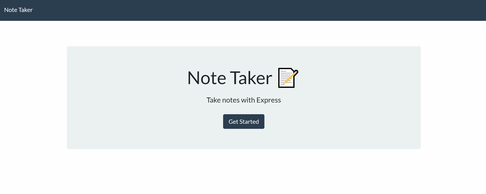

# Note Taker
  
  
  
  ## DESCRIPTION 
  
  This application uses node and express to allow the user to input and save useful note reminders for productivity. Notes may also be deleted. It retrieves user's note input from a JSON file.
  ## Table of Contents
  * [Installation](#installation)
  * [Usage](#usage)
  * [Contributing](#contributing)
  * [tests](#tests)
  * [license](#license)
    
    ## INSTALLATION 
    
    Clone the repository to a local directory. Run `npm install` to install dependencies at your root. the note taker is [live on Heroku](https://safe-badlands-86120.herokuapp.com/) for use as well.
    
    ## USAGE
    
    Click "Get Started" button on the homepage. From here, you will be able to enter a name for your note, and a description for your note. Click on the save icon to push your saved note to a list on the left side of the page. Click the trash icon to delete saved notes. Click on the pencil icon to write a new note. 

    ## PREVIEW
    
    
    ## TESTS
    
    Feel free to add tests!
  
    ## LICENSE
  
  mit
  
  ---------------------
  
    ## Questions?
  
  For any questions, please contact me with the information below:
  
  Github: [@dillon-smith-us](https://api.github.com/users/dillon-smith-us)
  